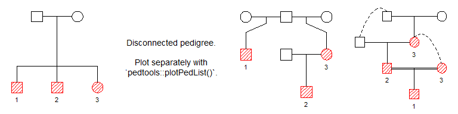
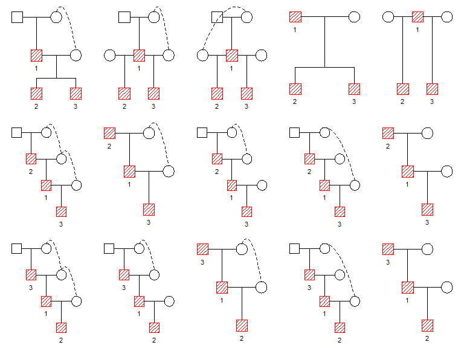
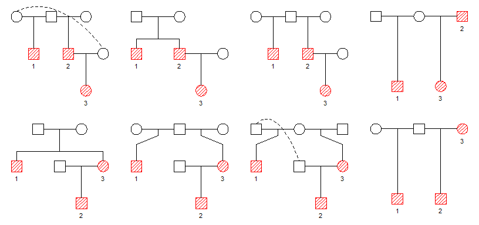
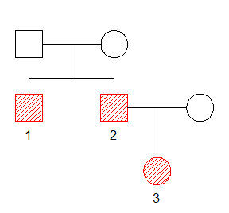
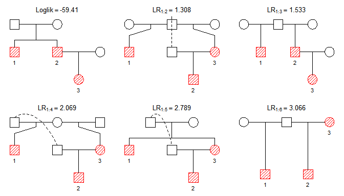

<!-- README.md is generated from README.Rmd. Please edit that file -->

# pedbuildr

The goal of pedbuildr is to reconstruct small/medium-sized pedigrees
from genotype data. The most important functions of the package are

  - `buildPeds()` : generates all pedigrees containing a given set of
    members
  - `reconstruct()`: finds the most likely pedigree given the available
    genotype data

## Installation

The development version of pedbuildr is available from GitHub:

``` r
remotes::install_github("magnusdv/pedbuildr")
```

Load the package into R as follows:

``` r
library(pedbuildr)
#> Loading required package: pedtools
```

# Building pedigree lists

Suppose we want to find all pedigrees linking 3 individuals: two males
and one female, labelled `1`, `2` and `3` respectively. Using the
default restriction to connected pedigrees, `buildPeds()` identifies 105
such pedigrees:

``` r
plist = buildPeds(ids = 1:3, sex = c(1, 1, 2))
length(plist)
#> [1] 105
```

Here are some of them:

``` r
plotPeds(plist[c(1, 20, 50, 105)])
```



The function `plotPeds()` is a thin wrapper around
`pedtools::plot.ped()`, and highlights the original individuals in each
pedigree.

## Restricting the pedigree search

With more than a handful individuals, the number of pedigrees quickly
becomes uncontrollably large. Hence it becomes vital to impose
restrictions on the pedigree space.

#### Linear inbreeding

As a further restriction, one may disallow certain types of inbreeding.
Many of the pedigrees found above contain matings between
parent-offspring, or even grandparent-grandchild. In many practical
cases these may be irrelevant. To skip pedigrees with such features, we
add `maxLinearInb = 0`.

``` r
plist2 = buildPeds(ids = 1:3, sex = c(1, 1, 2), maxLinearInb = 0)
length(plist2)
#> [1] 50
```

If we set `maxLinearInb = 1` instead, then parent-child mating is
allowed, but not grandparent-grandchild or higher separations.

#### Known parent-child pairs

Known parent-child pairs are conveyed to `buildPeds()` using the
`knownPO` parameter. For instance, in our running example suppose we
know that 2 and 3 form a parent-child pair (in some order).

``` r
plist3 = buildPeds(ids = 1:3, sex = c(1, 1, 2), maxLinearInb = 0, 
                   knownPO = list(2:3))
length(plist3)
#> [1] 19
```

Here is a selection of these pedigrees:

``` r
plotPeds(plist3[c(2, 3, 9, 18)])
```



#### Further restrictions on parent-child pairs

We may also know that certain pairs are *not* parent-child; this can be
imposed by using the `notPO` parameter. Another option is to set
`allKnown = TRUE`, meaning that `knownPO` should be taken as the
complete list of parent-child pairs among the input individuals. We add
this to our running example:

``` r
plist4 = buildPeds(ids = 1:3, sex = c(1, 1, 2), maxLinearInb = 0, 
                   knownPO = list(2:3), allKnown = TRUE)
length(plist4)
#> [1] 8
```

Here are the remaining pedigrees:

``` r
plotPeds(plist4)
```



# Pedigree reconstruction

The aim of this section is to show how to perform pedigree
reconstruction. We start with the “true” pedigree and simulate some
marker data for it. We will then try to reconstruct it from the marker
data.

## Example

Suppose the true relationship between individuals `1`, `2` and `3` is as
follows:



The pedigree is created with the following code.

``` r
x = nuclearPed(fa = "fa", mother = "mo", children = 1:2)
x = addDaughter(x, parent = 2, id = 3)

# Plot
plot(x, hatched = 1:3, labs = 1:3, col = list(red = 1:3))
```

We simulate genotypes for 10 markers, each with 4 alleles. The
simulation is done with the `markerSim()` function from the `forrel`
package.

``` r
x = forrel::markerSim(x, N = 10, ids = 1:3, alleles = 1:4, verbose = F, seed = 123)
x
#>    id fid  mid sex <1> <2> <3> <4> <5>
#>    fa   *    *   1 -/- -/- -/- -/- -/-
#>    mo   *    *   2 -/- -/- -/- -/- -/-
#>     1  fa   mo   1 1/3 1/3 1/4 1/3 4/4
#>     2  fa   mo   1 1/1 1/3 4/4 4/4 3/4
#>  NN_1   *    *   2 -/- -/- -/- -/- -/-
#>     3   2 NN_1   2 1/2 1/3 2/4 1/4 3/4
#> Only 5 (out of 10) markers are shown.
```

Now we try to reconstruct the pedigree from the data, using the
`reconstruct()` function. When we feed `x` into this function, it will
extract the allele matrix, marker attributes and gender data, but strip
the pedigree information. It then calls `buildPeds()` to generate a list
of candidate pedigrees. Finally, it computes the likelihood of each
alternative, and sort them in descending probability.

``` r
result = reconstruct(x)
#> Pedigree parameters:
#>   ID labels: 1, 2, 3
#>   Sex: 1, 1, 2
#>   Age info: -
#>   Known PO: -
#>   Known non-PO: -
#>   Connected only: TRUE
#>   Symmetry filter: TRUE
#>   Linear inbreeding: Inf
#> 
#> Building pedigree list:
#>   Undirected adjacency matrices: 8 
#>   Directed adjacency matrices: 22 
#>   After adding parents: 124 
#>   Connected solutions: 105 
#> 
#> Computing the likelihood of 105 pedigrees.
#> Sorting by descending likelihood.
#> Total time used:  1.22 secs
```

Here are the top results:

``` r
plot(result, top = 6)
```



The correct pedigree was the most likely one, but only just so\! With
more markers the difference would have been bigger.
