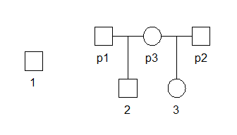
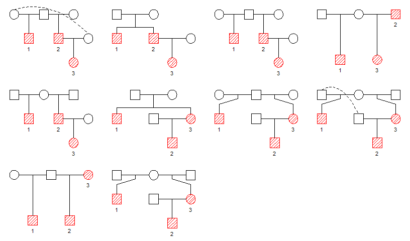
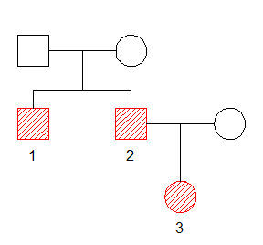
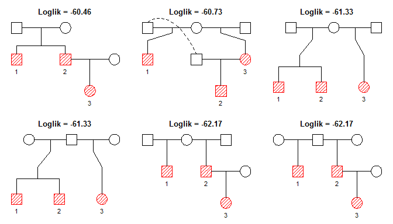

<!-- README.md is generated from README.Rmd. Please edit that file -->
pedbuildr
=========

The goal of pedbuildr is to reconstruct small/medium-sized pedigrees from genotype data. The most important functions of the package are

-   `buildPeds()` : generates all pedigrees containing a given set of members
-   `reconstruct()`: finds the most likely pedigree given the available genotype data

Installation
------------

The development version of pedbuildr is available from GitHub:

``` r
remotes::install_github("magnusdv/pedbuildr")
```

Load the package into R as follows:

``` r
library(pedbuildr)
#> Loading required package: pedtools
```

Building pedigree lists
=======================

Suppose we want to find all pedigrees linking 3 individuals: two males and one female, labeled `1`, `2` and `3` respectively. Without any restrictions `buildPeds()` identifies 142 such pedigrees:

``` r
plist = buildPeds(ids = 1:3, sex = c(1, 1, 2))
length(plist)
#> [1] 142
```

Here are some of them:

``` r
plotPeds(plist[c(1, 20, 100, 141)])
```


The function `plotPeds()` is a thin wrapper around `pedtools::plot.ped()`, and highlights the original individuals in each pedigree. It does not handle disconnected pedigrees, so to inspect these we may use `pedtools::plotPedList()` instead:

``` r
plotPedList(plist[[20]], frames = F)
```



Restricting the pedigree search
-------------------------------

With more than a handful individuals, the number of pedigrees quickly becomes uncontrollably large. Hence it becomes vital to impose restrictions on the pedigree space.

#### Connectedness

By adding `connected = TRUE` to the call, `buildPeds()` will return only connected pedigrees. In our example, this takes the total number down to 120:

``` r
plist2 = buildPeds(ids = 1:3, sex = c(1, 1, 2), connected = TRUE)
length(plist2)
#> [1] 120
```

#### Linear inbreeding

As a further restriction, one may disallow certain types of inbreeding. Many of the pedigrees found above contain matings between parent-offspring, or even grandparent-grandchild. In many practical cases these may be irrelevant. To skip pedigrees with such features, we add `maxLinearInbreeding = 0`.

``` r
plist3 = buildPeds(ids = 1:3, sex = c(1, 1, 2), connected = TRUE, 
                   maxLinearInbreeding = 0)
length(plist3)
#> [1] 65
```

If we set `maxLinearInbreeding = 1` instead, then parent-child mating is allowed, but not grandparent-grandchild or higher separations.

#### Known parent-child pairs

Known parent-child pairs are conveyed to `buildPeds()` using the `knownPO` parameter. For instance, in our running example suppose we know that 2 and 3 form a parent-child pair (in some order).

``` r
plist4 = buildPeds(ids = 1:3, sex = c(1, 1, 2), connected = TRUE, 
                   maxLinearInbreeding = 0,
                   knownPO = list(2:3))
length(plist4)
#> [1] 22
```

Here is a selection of these pedigrees:

``` r
plotPeds(plist4[c(2, 3, 11, 15, 22)])
```


#### Further restrictions on parent-child pairs

We may also know that certain pairs are *not* parent-child; this can be imposed by using the `notPO` parameter. Alternatively, we can include `allKnown = TRUE`, meaning that `knownPO` should be taken as the complete list of parent-child pairs among the input individuals.

``` r
plist5 = buildPeds(ids = 1:3, sex = c(1, 1, 2), connected = TRUE, 
                   maxLinearInbreeding = 0,
                   knownPO = list(2:3), 
                   allKnown = TRUE)
length(plist5)
#> [1] 10
```

Here are the final solutions:

``` r
plotPeds(plist5)
```



Which pedigrees are included in the `buildPeds()` algorithm?
------------------------------------------------------------

TODO

Pedigree reconstruction
=======================

The aim of this section is to show how to perform pedigree reconstruction. We start with some "true" pedigree and simulate some marker data for it. We then forget the pedigree structure, and then see if we are able to reconstruct it from the marker data.

Example
-------

Suppose the true relationship between individuals `1`, `2` and `3` is as follows: 

To generate some data, we create the true pedigree and simulate 10 markers (each with 4 alleles). The simulation is done with `markerSim()` from the `forrel` package.

``` r
x = nuclearPed(fa = "fa", mother = "mo", children = 1:2)
x = addDaughter(x, parent = 2, id = 3)
#> Mother: Creating new individual with ID = NN_1
# plot(x)

# Simulate
x = forrel::markerSim(x, N = 10, ids = 1:3, alleles = 1:4, verbose = F, seed = 123)
x
#>    id fid  mid sex <1> <2> <3> <4> <5>
#>    fa   *    *   1 -/- -/- -/- -/- -/-
#>    mo   *    *   2 -/- -/- -/- -/- -/-
#>     1  fa   mo   1 1/1 4/1 4/2 3/1 4/4
#>     2  fa   mo   1 3/1 3/1 4/4 4/4 4/4
#>  NN_1   *    *   2 -/- -/- -/- -/- -/-
#>     3   2 NN_1   2 1/2 3/4 4/2 4/1 4/2
#> Only 5 (out of 10) markers are shown. See `?print.ped` for options.
```

We extract the allele matrix and the locus attributes of the 10 markers.

``` r
genodata = getAlleles(x, ids = 1:3)
loci = lapply(x$markerdata, attributes)
```

Now let us try to reconstruct the pedigree from the data. The main input to the `reconstruct()` function is the `alleleMatrix` and the `loci` parameters. By default the function will then call our friend `buildPeds()` from the previous section to generate a list of candidate pedigrees. (The number of target individuals is determined by the number of rows in `alleleMatrix`.) In this example we won't impose any restrictions on the pedigree space, so we simply indicate the genders.

``` r
result = reconstruct(alleleMatrix = genodata, loci = loci, sex = c(1, 1, 2))
#> Building pedigree list
#> Undirected adjacency matrices: 8 
#> Directed adjacency matrices: 22 
#> After adding parents: 142 
#> Pedigrees: 142 
#> 
#> Computing likelihoods of 142 pedigrees...done!
```

The function `plotBestPeds()` show the pedigrees with the highest likelihood:

``` r
plotBestPeds(result, top = 6)
```



Lo and behold - the correct pedigree was the most likely one!
