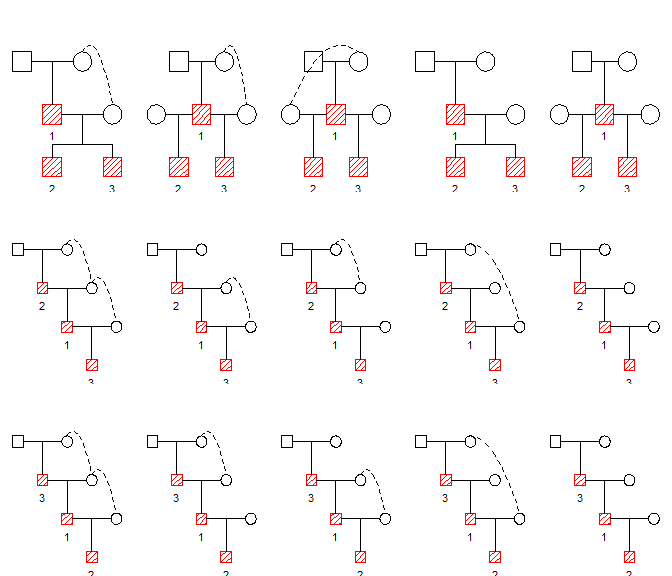

<!-- README.md is generated from README.Rmd. Please edit that file -->
pedbuildr
=========

The goal of pedbuildr is to reconstruct small/medium-sized pedigrees from genotype data. The most important functions of the package are

-   `buildPeds()` : generates all pedigrees containing a given set of members
-   `reconstruct()` (TO APPEAR): finds the most likely pedigree given the available genotype data

Installation
------------

The development version of pedbuildr is available from GitHub:

``` r
remotes::install_github("magnusdv/pedbuildr")
```

Example: Building pedigree lists
--------------------------------

``` r
library(pedbuildr)
#> Loading required package: pedtools
```

Suppose we are given 3 male individuals, labeled `1`, `2` and `3`. Using the `buildPeds()` function we create a list of all pedigrees containing these individuals:

``` r
plist = buildPeds(ids = 1:3, sex = c(1, 1, 1))
length(plist)
#> [1] 130
```

Quite a large number! Let's see what the first 6 pedigrees look like. The function `plotPeds()` is a thin wrapper around `pedtools::plot.ped()`, and highlights the original individuals in each pedigree.

``` r
plotPeds(plist[1:6])
```


------------------------------------------------------------------------

To reduce the number of pedigrees, we can put a restriction on the family structure. Suppose (e.g. after pairwise relatedness estimation) is known that individuals 1 and 2 form a parent-offspring pair, and likewise 1 and 3. In both cases, however, it is unknown which one is the parent.

We convey this new piece of information by using the `knownPO` parameter:

``` r
plist2 = buildPeds(1:3, sex = c(1, 1, 1), knownPO = list(c(1,2), c(1,3)))
length(plist2)
#> [1] 15
```

Here are the 15 pedigrees:

``` r
plotPeds(plist2)
```

 Note: The dotted curves indicate identical individuals. Hence there is a lot of inbreeding/incest in the pedigrees shown above.

Which pedigrees are included in the `buildPeds()` algorithm?
------------------------------------------------------------

TODO
