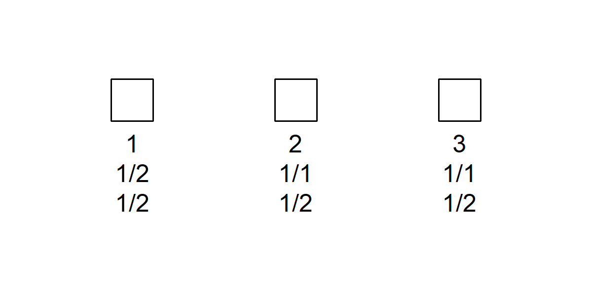
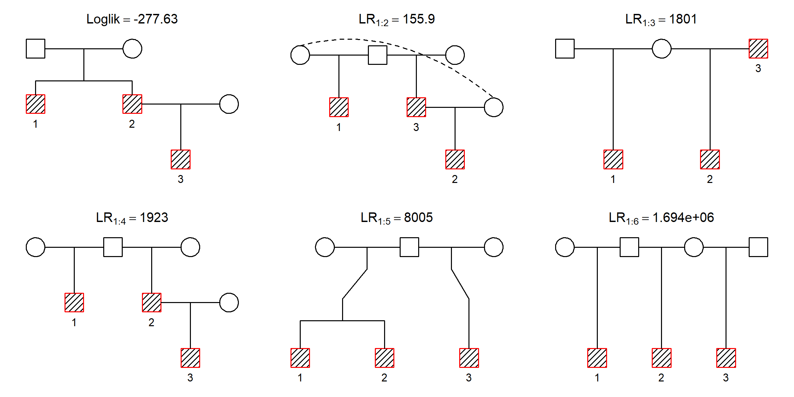
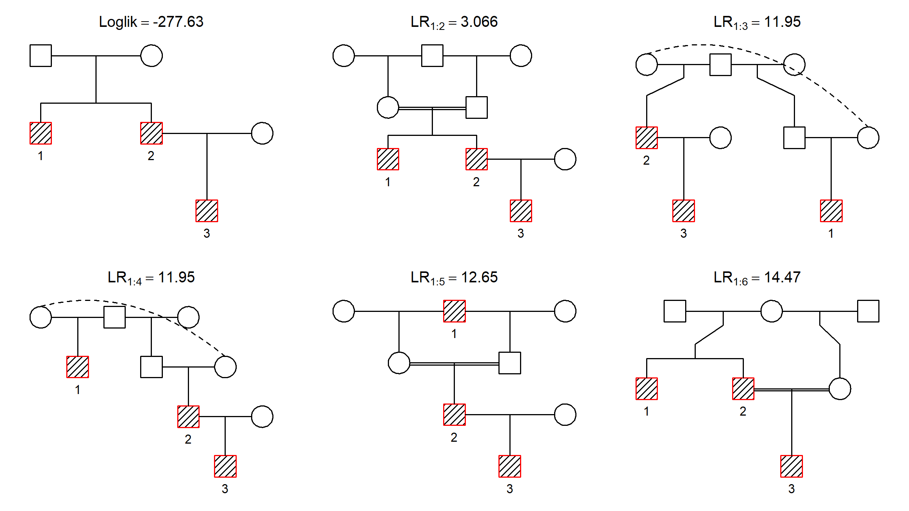

<!-- README.md is generated from README.Rmd. Please edit that file -->

# pedbuildr

<!-- badges: start -->

[](https://CRAN.R-project.org/package=pedbuildr)
[](https://cran.r-project.org/package=pedbuildr)
[](https://cran.r-project.org/package=pedbuildr)
<!-- badges: end -->

The goal of **pedbuildr** is to reconstruct pedigrees from genotype
data. This is done by optimising the likelihood over all possible
pedigrees subject to given restrictions. As part of the
[pedsuite](https://magnusdv.github.io/pedsuite/) ecosystem of R packages
for pedigree analysis, it uses
[pedtools](https://github.com/magnusdv/pedtools) for handling pedigrees,
and imports [pedprobr](https://github.com/magnusdv/pedprobr) for
calculating pedigree likelihoods.

See also the `ibdEstimate()` function of
[forrel](https://github.com/magnusdv/forrel), which does pairwise
relatedness estimation.

## Installation

The **pedbuildr** package can be installed from CRAN as follows:

``` r
install.packages("pedbuildr")
```

Alternatively, the latest development version is available from GitHub.

``` r
# install.packages("devtools")
devtools::install_github("magnusdv/pedbuildr")
```

## A reconstruction example

To get started, load **pedbuildr**.

``` r
library(pedbuildr)
#> Loading required package: pedtools
```

The built-in dataset `trioData` contains simulated genotypes for three
individuals at 100 equifrequent SNP markers. Here are the first 10
columns:

``` r
trioData[, 1:10]
#>   <1>   <2>   <3>   <4>   <5>   <6>   <7>   <8>   <9>   <10> 
#> 1 "1/2" "1/2" "1/1" "1/2" "1/2" "1/2" "1/2" "2/2" "1/2" "1/2"
#> 2 "1/1" "1/2" "1/2" "2/2" "1/2" "2/2" "1/2" "2/2" "1/2" "2/2"
#> 3 "1/1" "1/2" "1/2" "2/2" "1/1" "1/2" "1/2" "1/2" "1/2" "2/2"
```

As a simple demonstration we will try to reconstruct the pedigree
connecting these individuals assuming they are all males. To initialise
the process we create them as singletons and attach the marker data. The
`locusAttributes` argument tells R that all the markers are diallelic
with alleles 1 and 2.

``` r
x = list(singleton(1), 
         singleton(2), 
         singleton(3)) |> 
  setMarkers(alleleMatrix = trioData, locusAttributes = "snp12")

plotPedList(x, frames = FALSE)
```



To reconstruct the pedigree, simply run `reconstruct()`:

``` r
res = reconstruct(x)
#> Pedigree parameters:
#>   ID labels: 1, 2, 3
#>   Sex: 1, 1, 1
#>   Extra: parents
#>   Age info: -
#>   Known PO: -
#>   Known non-PO: -
#>   No children: -
#>   Connected only: TRUE
#>   Symmetry filter: TRUE
#>   Max inbreeding: 0.0625
#>   Linear inbreeding: FALSE
#> 
#> Building pedigree list:
#>   Undirected adjacency matrices: 8 
#>   Directed adjacency matrices: 16 
#>   After adding parents: 57 
#>   Connected solutions: 44 
#>   Excessive inbreeding: 0 
#> 
#> Computing the likelihood of 44 pedigrees.
#> Sorting by descending likelihood.
#> Total time used:  1.6 secs
```

A tailor-made `plot` function makes it easy to visualise the most likely
pedigrees:

``` r
plot(res, top = 6)
```



The most likely pedigree is plotted top left. The titles for the
remaining pedigrees give the likelihood ratio (LR) comparing the first
pedigree to the one shown. For example, the first solution is 155.9 more
likely than the second.

## Further options

*A priori* there are infinitely many possible pedigrees connecting a set
of individuals. (For example, two individuals may be *k*’th cousins for
any *k* = 1,2,… .) In order to obtain a manageable search space,
`reconstruct()` offers a range of restriction parameters:

- `extra`: The number of extra individuals allowed to connect the
  original individuals. (See further explanations below.)
- `age`: A vector of numeric (relative) ages or age inequalities. For
  example, `age = c("A > B,C", "B > D")` excludes B and C as ancestors
  of A, and D as an ancestor of B (but no assumption is made for C
  vs. D).
- `inferPO`: When this is `TRUE`, an initial pairwise estimation step is
  done to infer high-confidence parent/child pairs, and also
  *non*-parent/child pairs.
- `knownPO`: Known parent–offspring pairs. Note that these are
  *unordered* pairs, i.e., with no assumption on who is the parent and
  who is the child. (If this is known, use `age` to indicate it.)
- `notPO`: Pairs known not to be parent–offspring.
- `allKnown`: If TRUE, then `knownPO` is taken to be the complete list
  of parent–offspring pairs.
- `noChildren`: Individuals known to have no children.
- `maxInbreeding`: The highest permitted inbreeding coefficient in the
  pedigree. By default this is set to 1/16, which is appropriate for
  most projects involving human pedigrees.
- `linearInb`: The allowed level of inbreeding between linear
  descendants. For example, `linearInb = 1` allows mating between
  parent–child, but not grandparent–grandchild. The default value
  `FALSE` disallows all inbreeding of this type.
- `connected`: If TRUE (default), only connected pedigrees are
  considered.
- `sexSymmetry`: If TRUE (default) pedigrees are considered equal if
  they differ only in the sexes of the added parents, e.g., paternal
  versus maternal half-siblings.

Let us re-run the reconstruction of `trioData` adding a few of these
restrictions. We allow 3 extra individuals and indicate that individual
1 is older than the others. Furthermore, we ask the program to infer
parent-child relationships automatically. Finally we allow any amount of
inbreeding.

``` r
res2 = reconstruct(x, extra = 3, age = "1 > 2,3", inferPO = TRUE, maxInbreeding = 1)
#> Pairwise estimation:
#>   PO: 2-3 
#>   non-PO: 1-3 
#> 
#> Pedigree parameters:
#>   ID labels: 1, 2, 3
#>   Sex: 1, 1, 1
#>   Extra: 3
#>   Age info: 1>2, 1>3
#>   Known PO: 2-3
#>   Known non-PO: 1-3
#>   No children: -
#>   Connected only: TRUE
#>   Symmetry filter: TRUE
#>   Max inbreeding: 1
#>   Linear inbreeding: FALSE
#> 
#> Building pedigree list:
#>   First 2: 2 candidates (0.0027 secs)
#>   All 3 + 0 extra: 1 solutions | 3 candidates (0.00353 secs)
#>   All 3 + 1 extra: 9 solutions | 30 candidates | 21 duplicates removed (0.0491 secs)
#>   All 3 + 2 extra: 35 solutions | 266 candidates | 501 duplicates removed (0.221 secs)
#>   All 3 + 3 extra: 183 solutions | 183 candidates | 459 duplicates removed (0.842 secs)
#>   Total solutions: 228 
#>   Converting to ped
#>   Excessive inbreeding: 0 
#>   Time used: 1.07 secs 
#> 
#> Computing the likelihood of 228 pedigrees.
#> Sorting by descending likelihood.
#> Total time used:  18.1 secs
```

The most likely results this time are shown below:

``` r
plot(res2, top = 6)
```



We see that the same pedigree “wins”, but some inbred/esoteric
alternatives have appeared among the runners-up.

## More about `extra`

Arguably the most important parameter to `reconstruct()` is `extra`,
which controls the size of the pedigrees to consider. It can be either a
nonnegative integer, or the word “parents”. If an integer, it sets the
maximum number of extra members used to connect the original
individuals. (The final pedigrees may contain further extras still,
since missing parents are added at the end.)

If `extra = "parents"`, a special algorithm is invoked. First all
directed acyclic graphs between the original individuals are generated,
and then parents are added in all possible ways. This is (currently) the
default behaviour, since it avoids setting an *ad hoc* number of
“extras”. However, it only works well in relatively small cases.
