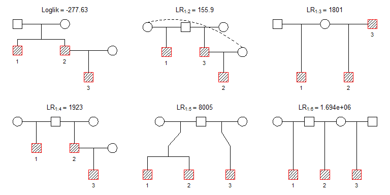

<!-- README.md is generated from README.Rmd. Please edit that file -->

# pedbuildr

The goal of **pedbuildr** is to reconstruct small/medium-sized pedigrees
from genotype data.

## Installation

The development version of **pedbuildr** is available from GitHub:

``` r
remotes::install_github("magnusdv/pedbuildr")
```

Load the package into R as follows:

``` r
library(pedbuildr)
#> Loading required package: pedtools
```

## A reconstruction example

To get started, we demonstrate how to reconstruct the pedigree
connecting three individuals from their genotypes at 100 SNP markers.
The (simulated) genotypes are contained in the dataset `trioData`
built-in to **pedbuildr**. Here are the first few columns:

``` r
trioData[, 1:10]
#>   id fid mid sex <1> <2> <3> <4> <5> <6>
#> 1  1   0   0   1 1/2 1/2 1/1 1/2 1/2 1/2
#> 2  2   0   0   1 1/1 1/2 1/2 2/2 1/2 2/2
#> 3  3   0   0   1 1/1 1/2 1/2 2/2 1/1 1/2
```

The first thing to do is to convert the data into pedigree object, using
the `as.ped()` function from **pedtools**.

``` r
x = as.ped(trioData, locusAttributes = "snp-12")
summary(x)
#> List of 3 singletons.
#> Labels: 1 (male), 2 (male), 3 (male).
#> 100 attached markers.
```

The `locusAttributes` argument tells R that all the markers are
diallelic with alleles 1 and 2. By default, the alleles have equal
frequencies.

To reconstruct the pedigree, simply run `reconstruct()`:

``` r
res = reconstruct(x)
#> Pedigree parameters:
#>   ID labels: 1, 2, 3
#>   Sex: 1, 1, 1
#>   Extra: parents
#>   Age info: -
#>   Known PO: -
#>   Known non-PO: -
#>   No children: -
#>   Connected only: TRUE
#>   Symmetry filter: TRUE
#>   Linear inbreeding: TRUE
#> 
#> Building pedigree list:
#>   Undirected adjacency matrices: 8 
#>   Directed adjacency matrices: 16 
#>   After adding parents: 114 
#>   Connected solutions: 95 
#> 
#> Computing the likelihood of 95 pedigrees.
#> Sorting by descending likelihood.
#> Total time used:  6.04 secs
```

The most likely pedigrees are plotted as follows.

``` r
plot(res, top = 6)
```



## Further options

*A priori* there are infinitely many possible pedigrees connecting a set
of individuals. (For example, two individuals may be *k*’th cousins for
any *k* = 1,2,… .) In order to obtain a manageable search space,
`reconstruct()` offers a range of restriction parameters:

-   `extra`: The number of extra individuals allowed to connect the
    original individuals. (See further explanations below.)
-   `age`: A character vector describing age inequalities. For example,
    `age = c("A > B,C", "B > D")` excludes B and C as ancestors of A,
    and D as an ancestor of B (but no assumption is made for C vs. D).
-   `inferPO`: If TRUE, an initial stage of pairwise IBD estimation is
    done, in order to infer certain parent-child pairs, as well as
    certain non-parent-child pairs.
-   `knownPO`: Known parent–offspring pairs.
-   `notPO`: Pairs known not to be parent–offspring.
-   `allKnown`: If TRUE, then `knownPO` is the complete list of
    parent–offspring pairs.
-   `noChildren`: Individuals known to have no children.
-   `linearInb`: The allowed level of inbreeding between linear
    descendants. For example, `linearInb = 1` allows mating between
    parent–child, but not grandparent–grandchild. Set to FALSE to
    disallow all inbreeding of this type.
-   `connected`: If TRUE (default), only connected pedigrees are
    considered.
-   `sexSymmetry`: If TRUE (default) pedigrees are considered equal if
    they differ only in the sexes of the added parents, e.g., paternal
    versus maternal half-siblings.

Let us re-run the reconstruction of `trioData` adding a few of these
restrictions. We allow 3 extra individuals and indicate that individual
1 is older than the others. Furthermore, we ask the program to infer
parent-child relationships automatically, and disallow linear
inbreeding.

``` r
res2 = reconstruct(x, extra = 3, age = "1 > 2,3", inferPO = TRUE, linearInb = FALSE)
#> Pairwise estimation:
#>   PO: 2-3 
#>   non-PO: 1-3 
#> 
#> Pedigree parameters:
#>   ID labels: 1, 2, 3
#>   Sex: 1, 1, 1
#>   Extra: 3
#>   Age info: 1>2, 1>3
#>   Known PO: 2-3
#>   Known non-PO: 1-3
#>   No children: -
#>   Connected only: TRUE
#>   Symmetry filter: TRUE
#>   Linear inbreeding: FALSE
#> 
#> Building pedigree list:
#>   First 2: 2 candidates (0 secs)
#>   All 3 + 0 extra: 1 solutions | 3 candidates (0 secs)
#>   All 3 + 1 extra: 9 solutions | 30 candidates | 21 duplicates removed (0.0156 secs)
#>   All 3 + 2 extra: 35 solutions | 266 candidates | 501 duplicates removed (0.217 secs)
#>   All 3 + 3 extra: 183 solutions | 183 candidates | 459 duplicates removed (0.932 secs)
#> Total solutions: 228 
#> Converting to ped
#> Total time: 0.991 secs
#> Computing the likelihood of 228 pedigrees.
#> Sorting by descending likelihood.
#> Total time used:  29.8 secs
```

The most likely results this time are shown below:

``` r
plot(res2, top = 6)
```


We see that the same pedigree “wins”, but some esoteric alternatives
have appeared among the runners-up.

## More about `extra`

Arguably the most important parameter to `reconstruct()` is `extra`,
which controls the size of the pedigrees to consider. It can be either a
nonnegative integer, or the word “parents”. If an integer, it sets the
maximum number of extra members used to connect the original
individuals. (The final pedigrees may contain further extras still,
since missing parents are added at the end.)

If `extra = "parents"`, a special algorithm is invoked. First all
directed acyclic graphs between the original individuals are generated,
and then parents are added in all possible ways. This is (currently) the
default behaviour, since it avoids setting an *ad hoc* number of
“extras”. However, it only works well in relatively small cases.
